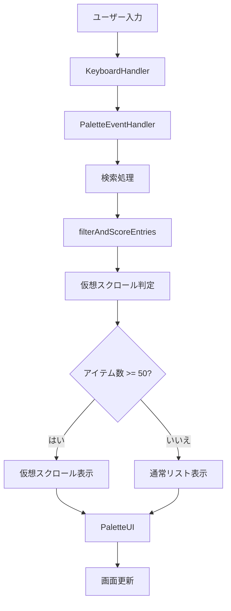

# Web Command Palette - 実装ドキュメント

## 概要

Web Command Paletteは、ブラウザ上で動作するユーザースクリプト製コマンドパレットです。⌘P / Ctrl+P キーで起動し、サイトの素早い起動、タグフィルタリング、使用頻度学習などの機能を提供します。

## プロジェクト構造

```
web-command-palette/
├── src/                    # ソースコードディレクトリ
│   ├── main.ts            # アプリケーションのエントリーポイント
│   ├── components/        # UIコンポーネント
│   ├── core/              # コアロジック
│   ├── types/             # TypeScript型定義
│   ├── constants/         # 定数定義
│   └── utils/             # ユーティリティ関数
├── tests/                 # テストファイル
├── dist/                  # ビルド出力先
└── 設定ファイル群
```

## アーキテクチャ

### 1. メインアプリケーション ([`main.ts`](src/main.ts:1))

アプリケーションのエントリーポイントであり、[`CommandPaletteApp`](src/main.ts:20) クラスを定義しています。

#### 主要な責務
- 各コンポーネントの初期化と連携
- グローバルホットキーの設定
- ユーザースクリプトメニューの登録
- イベントハンドラの管理

#### 主要なコンポーネント
```typescript
class CommandPaletteApp {
  private state: AppState;
  private dom: DOMElements;
  private autocompleteState: AutocompleteState;
  
  private palette: Palette;
  private autocomplete: Autocomplete;
  private manager: Manager;
  private settings: SettingsUI;
  private paletteCore: PaletteCore;
  private keyboardHandler: KeyboardHandler;
}
```

### 2. コンポーネントアーキテクチャ

#### パレットコンポーネント群

##### Paletteクラス ([`palette.ts`](src/components/palette.ts:1))
メインパレットUIを管理する統括クラス。UI生成とイベント処理を分離したアーキテクチャを採用しています。

```typescript
export class Palette {
  private state: AppState;
  private dom: DOMElements;
  private ui: PaletteUI;
  private eventHandler: PaletteEventHandler;
}
```

##### PaletteUIクラス ([`palette-ui.ts`](src/components/palette-ui.ts:1))
パレットのUI生成と管理を担当します。

- Shadow DOMを使用したスタイルの分離
- 仮想スクロールの実装（50アイテム以上で有効化）
- レスポンシブなパネル位置調整
- フォーカストラップの実装

##### PaletteEventHandlerクラス ([`palette-event-handler.ts`](src/components/palette-event-handler.ts:1))
パレットのイベント処理を担当します。

- デバウンスされた入力処理
- キーボードナビゲーション
- マウスイベントの処理
- Bing検索の統合

##### Autocompleteクラス ([`autocomplete.ts`](src/components/autocomplete.ts:1))
タグオートコンプリート機能を提供します。

- 階層タグのサポート
- タグ使用回数の表示
- 新規タグ作成の提案
- タグ候補のフィルタリング

### 3. コア機能

#### PaletteCoreクラス ([`core/palette.ts`](src/core/palette.ts:1))
パレットのコアロジックを管理します。

- エントリ実行処理
- URL開く動作の管理
- Bing検索機能
- 設定キャッシュの管理

#### 状態管理 ([`core/state.ts`](src/core/state.ts:1))
アプリケーションの状態を一元管理します。

```typescript
export interface AppState {
  isOpen: boolean;
  currentItems: SiteEntry[];
  activeIndex: number;
  cachedSettings: Settings | null;
  lastUpdated: number;
}
```

- StateManagerクラスによる状態管理
- 履歴機能の実装
- 状態変更リスナーのサポート

#### ストレージ管理 ([`core/storage.ts`](src/core/storage.ts:1))
データの永続化を管理します。

- サイトデータのCRUD操作
- 設定の保存と読み込み
- faviconキャッシュの管理
- 使用回数の追跡

#### ホットキー処理 ([`core/hotkey.ts`](src/core/hotkey.ts:1))
グローバルホットキーの処理を管理します。

- 複数のホットキー設定のサポート
- ブロックサイトの判定
- 自動オープン機能
- パレット表示状態の管理

#### キーボード処理 ([`core/keyboard.ts`](src/core/keyboard.ts:1))
キーボードイベントの詳細な処理を管理します。

- ナビゲーションキーの処理
- オートコンプリートのキーボード操作
- 日本語入力の対応
- 修飾キーの処理

### 4. ユーティリティ機能

#### 検索機能 ([`utils/search.ts`](src/utils/search.ts:1))
高度な検索機能を提供します。

- ファジー検索の実装
- タグフィルタリング
- 使用頻度によるスコアリング
- 階層タグのサポート

#### DOM操作 ([`utils/dom.ts`](src/utils/dom.ts:1))
DOM要素の操作と生成を担当します。

- favicon要素の動的生成
- faviconの自動発見
- キャッシュ管理
- エラーハンドリング

#### イベント処理 ([`utils/events.ts`](src/utils/events.ts:1))
イベントリスナーの管理を提供します。

- 統一的なイベントリスナーAPI
- フォーカストラップの実装
- オートコンプリート用の特殊イベント処理
- イベントリスナーのクリーンアップ

#### 仮想スクロール ([`utils/virtual-scroll.ts`](src/utils/virtual-scroll.ts:1))
大量のアイテムを効率的に表示します。

- パフォーマンス最適化
- 動的なアイテム高さ対応
- スクロール位置のキャッシュ
- バイナリサーチによる高速化

#### UIユーティリティ ([`utils/ui.ts`](src/utils/ui.ts:1))
UI関連のヘルパー関数を提供します。

- トーストメッセージの表示
- アニメーション効果

### 5. 型定義

#### サイトエントリ型 ([`types/site.ts`](src/types/site.ts:1))
サイトデータの型定義を提供します。

```typescript
export interface SiteEntry {
  id: SiteId;
  type: SiteType;
  name: string;
  url: URLString | URLTemplate;
  tags: Tag[];
  // 拡張プロパティ
  category?: string;
  priority?: number;
  isActive?: boolean;
  metadata?: Record<string, any>;
}
```

#### 設定型 ([`types/settings.ts`](src/types/settings.ts:1))
アプリケーション設定の型定義を提供します。

```typescript
export interface Settings {
  hotkeyPrimary: HotkeyString;
  hotkeySecondary: HotkeyString;
  enterOpens: EnterOpensBehavior;
  blocklist: string;
  theme: ThemeType;
  accentColor: string;
  autoOpenUrls: string[];
}
```

### 6. 定数と設定

#### デフォルト値 ([`constants/defaults.ts`](src/constants/defaults.ts:1))
アプリケーションのデフォルト値を定義します。

- デフォルトサイトデータ
- デフォルト設定
- デフォルトプレースホルダー

#### テーマ ([`constants/themes.ts`](src/constants/themes.ts:1))
カラーテーマの定義を提供します。

- ダークテーマ
- ライトテーマ
- CSSカスタムプロパティの定義

## 主要な機能

### 1. ファジー検索
- 曖昧な入力でも目的のサイトを高速に検索
- スコアリングアルゴリズムによる関連性の高い結果の表示
- 使用頻度による検索結果の順位付け

### 2. タグフィルタリング
- `@タグ名` 形式でのタグフィルタリング
- 階層タグのサポート（例: `ai/tools`）
- タグオートコンプリート機能

### 3. 使用頻度学習
- サイトの使用回数を記録
- 頻繁に使用するサイトを検索結果の上位に表示
- LRU（Least Recently Used）アルゴリズムによるキャッシュ管理

### 4. 仮想スクロール
- 大量のアイテムを効率的に表示
- 50アイテム以上で自動的に有効化
- パフォーマンスの最適化

### 5. テーマシステム
- ダーク/ライトテーマの切り替え
- カスタムアクセントカラーの設定
- CSSカスタムプロパティによる動的なスタイル変更

### 6. グローバルホットキー
- ⌘P / Ctrl+P でのパレット起動
- 複数のホットキー設定のサポート
- ブロックサイトの除外機能

## データフロー



## パフォーマンス最適化

### 1. 仮想スクロール
- 大量のアイテム表示時のパフォーマンス向上
- 表示領域内のアイテムのみをレンダリング

### 2. デバウンス処理
- 入力イベントのデバウンスによる不要な再描画の抑制
- 150msのデバウンス時間

### 3. キャッシュ戦略
- 設定データのキャッシュ（1秒TTL）
- faviconキャッシュの管理
- 使用回数キャッシュの効率的な管理

### 4. メモリ管理
- イベントリスナーの適切なクリーンアップ
- DOM参照の管理
- WeakMap/WeakSetの活用

## 拡張性

### 1. プラグインアーキテクチャ
- コンポーネントの追加が容易
- 新しい検索アルゴリズムの組み込み
- カスタムテーマの追加

### 2. 設定システム
- 柔軟な設定管理
- 設定のマイグレーション機能
- エクスポート/インポート機能

### 3. イベントシステム
- イベント駆動型のアーキテクチャ
- コンポーネント間の疎結合
- リスナーの動的登録・解除

## テスト

### 1. 単体テスト
- Jestを使用したテストフレームワーク
- 各コンポーネントの個別テスト
- ユーティリティ関数のテスト

### 2. 統合テスト
- コンポーネント間の連携テスト
- インドツーエンドの機能テスト

## ビルドとデプロイ

### 1. ビルドプロセス
- TypeScriptからJavaScriptへの変換
- Rollupによるバンドル
- ユーザースクリプト形式での出力

### 2. 開発ワークフロー
- `npm run dev` - ウォッチモードでの開発
- `npm run build` - 本番用ビルド
- `npm test` - テスト実行

## 今後の改善点

### 1. パフォーマンス
- さらなる仮想スクロールの最適化
- メモリ使用量の削減
- レンダリングパフォーマンスの向上

### 2. 機能拡張
- より高度な検索機能
- プラグインシステムの実装
- 同期機能の追加

### 3. UX改善
- アニメーションの向上
- アクセシビリティの改善
- モバイル対応の強化

## まとめ

Web Command Paletteは、モダンなTypeScriptアーキテクチャに基づいて設計されたユーザースクリプトです。コンポーネントベースの設計、効率的な状態管理、パフォーマンス最適化により、高速で使いやすいコマンドパレットを実現しています。拡張性の高いアーキテクチャにより、将来的な機能追加も容易に行えるようになっています。